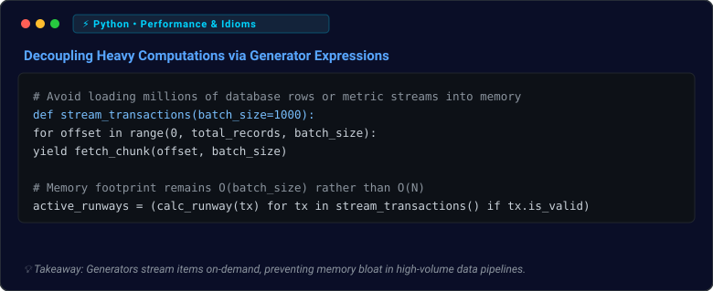

<!-- ================================================================= -->
<!-- HERO HEADER -->
<!-- ================================================================= -->
<div align="center">


<p align="center">
  <a href="https://github.com/lokeshmudunuri">
    
  </a>
</p>

<!-- Clean Identity & Location Block -->
<h3>Mudunuri Lokesh Varma</h3>
<p>
  <b>Frontend Developer • Aspiring AI & ML Engineer</b>
  <br/>
  📍 Bhimavaram, India
</p>

<!-- Social Links -->
<p align="center">
  <a href="https://github.com/lokeshmudunuri">
    
  </a>
  &nbsp;
  <a href="https://www.linkedin.com/in/mudunuri-lokesh-varma-b10a74375/">
    
  </a>
  &nbsp;
  <a href="https://lokeshmudunuri.github.io/portifolio/">
    
  </a>
  &nbsp;
  <a href="mailto:lokeshpersonal147@gmail.com">
    
  </a>
</p>

<!-- Verified Academic Metadata Badges -->
<p align="center">
  
  &nbsp;•&nbsp;
  
  &nbsp;•&nbsp;
  
</p>

</div>

---

### 👨‍💻 About Me

* **Who I Am:** Third-year B.Tech student in Artificial Intelligence & Machine Learning at Vishnu Institute of Technology, Bhimavaram (Class of 2028).
* **What I Build:** Interactive, accessible web applications with React and Python backends that solve practical software and operational challenges.
* **Technical Direction:** Architecting systems where deterministic mathematics and validation happen first in Python/Pandas before passing structured context to AI models.
* **What I Am Learning:** Scalable React state architectures, exploratory data pipelines, heuristic anomaly detection, and agentic developer workflows.

---

### 🛠️ Technical Preferences & Stack

#### 💻 Programming Languages
<p>
  <a href="https://skillicons.dev">
    
  </a>
</p>

#### 🌐 Frontend Development
<p>
  <a href="https://skillicons.dev">
    
  </a>
</p>

#### ⚙️ Backend & APIs
<p>
  <a href="https://skillicons.dev">
    
  </a>
</p>

#### 📊 AI / ML & Data Science
<p>
  <a href="https://skillicons.dev">
    
  </a>
  &nbsp;
  
</p>

#### 🗄️ Databases & ORM
<p>
  <a href="https://skillicons.dev">
    
  </a>
  &nbsp;
  
</p>

#### 🛠️ Developer Tools & Environments
<p>
  <a href="https://skillicons.dev">
    
  </a>
  &nbsp;
  
</p>

---

### 🚀 Featured Projects

#### 1. Retail Sales & Inventory Co-Pilot
*Deterministic retail analytics dashboard and inventory intelligence copilot.*

* **What it does:** Solves multi-store retail stockout risks, overstocking, and inventory capital trapping across 90 days of transactions. Most importantly, it eliminates generative math hallucinations by never permitting an LLM to guess, round, or approximate business metrics.
* **How I built it:** Engineered a single-directional data pipeline. Raw transaction datasets (`sales`, `inventory`, `stores`, `products`) pass through defensive ingestion schemas, calculate metrics in Pandas, evaluate heuristic risk thresholds, and format verified JSON payloads for Google Gemini to interpret into executive directives.
* **Key engineering:**
  * *Deterministic Analytics Engine (`analytics.py`):* Computes rolling daily sales velocity, inventory runway days, dead-stock capital trapping, and period-over-period growth in pure Python.
  * *Attention Engine (`rules.py`):* Heuristic anomaly triggers for stockouts (<7 days runway), overstock (>60 days), and sudden store-level demand spikes.
  * *Grounded Reasoning & Fallback:* Strict 7-part executive output structure; fully operational with zero crashes when offline or when external API quotas are exhausted.
* **Stack:** `Python` · `FastAPI` · `Pandas` · `NumPy` · `SQLite` · `Gemini API`
* **Links:** [GitHub Repository](https://github.com/lokeshmudunuri/retail-sales-inventory-copilot) • [Video Walkthrough Demo](https://youtu.be/bf_dRJUs9sY?si=nrb72j-hBDLWkpNJ)

---

#### 2. MindCare — Mental Wellness Platform Concept
*Full-stack mental wellness application prototype bridging patients and practitioners.*

* **What it does:** Provides a structured, role-based mental health platform enabling patients to log emotional states and request care, while psychologists manage appointments, review patient history, and maintain clinical session notes.
* **How I built it:** Implemented a modular FastAPI REST backend coupled with a responsive single-page frontend. Features strict JWT authentication and role-based access control (RBAC), alongside a context-aware Google Gemini assistant outfitted with safety rails.
* **Key engineering:**
  * *Dual-Tier RBAC:* Decoupled workflows ensuring psychologists access clinical tools and patient notes while patients access wellness tracking and empathetic chat.
  * *Secure Authentication Flow:* PBKDF2-SHA256 password hashing via `passlib` and stateless token management via `python-jose`.
  * *Safety-Grounded AI:* Role-tuned prompts providing mindful self-care for users with hardcoded crisis escalation disclaimers, and structured session summaries for practitioners.
* **Stack:** `Python` · `FastAPI` · `JavaScript` · `SQLite` · `SQLAlchemy` · `JWT` · `Gemini API`
* **Links:** [GitHub Repository](https://github.com/lokeshmudunuri/smart-mind-care-ai)

---

#### 3. Dev Assistant AI
*AI-assisted developer tooling for codebase exploration and structural comprehension.*

* **What it does:** Assists developers in navigating unfamiliar codebases and legacy code by generating structural flow overviews, identifying function call hierarchies, and providing contextual code explanations.
* **How I built it:** Created a lightweight developer tool utilizing Python REST endpoints and local Git metadata to analyze script dependencies and summarize repository logic.
* **Key engineering:**
  * *Contextual Flow Extraction:* Parses code structures and dependencies to help developers onboard into existing projects faster.
  * *Developer Workflow Integration:* Lightweight CLI and API interface designed for local development exploration without heavy external dependencies.
* **Stack:** `Python` · `JavaScript` · `REST APIs` · `Git`
* **Links:** [GitHub Repository](https://github.com/lokeshmudunuri/Dev-assistant-ai)

---

### 🏆 Honors & Research Milestone

#### 🥇 2nd Prize — Researchers' Day | **OralSense AI**
*Presented at Vishnu Institute of Technology, Bhimavaram*

* **Research Problem:** Investigated computer-assisted preliminary triage to assist pathologists in screening high-resolution microscopic oral pathology images.
* **Academic Exploration:** Developed an academic concept targeting preliminary turnaround reduction from 30+ minutes down to 2–4 minutes during prototype testing.
* **Scope & Academic Integrity:** Explored and presented strictly as an academic research concept at Researchers' Day; not clinically validated or deployed for real-world medical diagnosis.

---

### ⚡ Daily Dev Code

<div align="center">
  
</div>

---

### 🔥 GitHub Streak & Analytics

<div align="center">

<a href="https://github.com/lokeshmudunuri">
  
</a>

<br/><br/>

<table align="center" border="0">
  <tr>
    <td align="center" valign="middle">
      
    </td>
    <td align="center" valign="middle">
      
    </td>
  </tr>
</table>

</div>

---

### 🐍 Contribution Activity

<div align="center">
  <picture>
    <source media="(prefers-color-scheme: dark)" srcset="https://raw.githubusercontent.com/lokeshmudunuri/lokeshmudunuri/output/github-snake-dark.svg"/>
    <source media="(prefers-color-scheme: light)" srcset="https://raw.githubusercontent.com/lokeshmudunuri/lokeshmudunuri/output/github-snake.svg"/>
    
  </picture>
</div>

---

### 🎯 Current Focus & Roadmap

```
├── ⚛️ Frontend Architecture   ──► Advancing modular React patterns, responsive UI, and client state
├── 📊 Data & ML Foundations   ──► Deepening feature preparation, exploratory pipelines, and supervised learning
├── ⚙️ Deterministic Pipelines ──► Marrying deterministic data validation with structured generative intelligence
└── 🤖 Agentic AI Concepts    ──► Multi-tool patterns, context routing, and grounded developer tooling
```

---

### 📬 Let's Connect

<div align="center">

<p>
  <b>Open to internships, research opportunities, hackathons, and meaningful software collaborations.</b>
</p>

<p>
  <a href="mailto:lokeshpersonal147@gmail.com">
    
  </a>
  &nbsp;
  <a href="https://www.linkedin.com/in/mudunuri-lokesh-varma-b10a74375/">
    
  </a>
  &nbsp;
  <a href="https://lokeshmudunuri.github.io/portifolio/">
    
  </a>
  &nbsp;
  <a href="https://github.com/lokeshmudunuri">
    
  </a>
</p>


</div>
